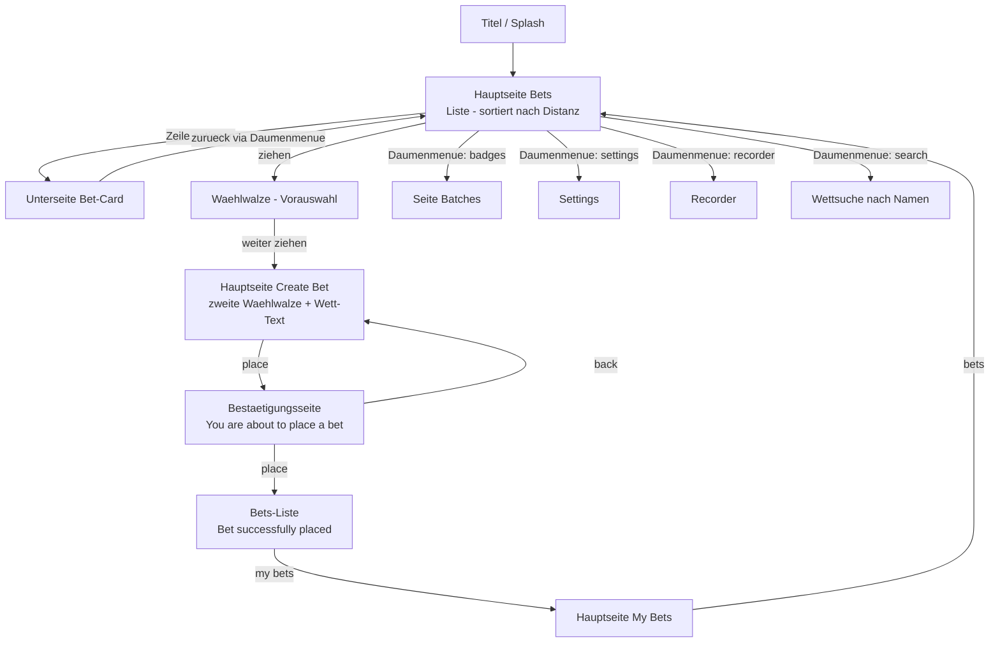

# BattleBet — Navigation & Interaktion (Spezifikation)

**Status:** Entwurf zur Bestätigung · **v1.0**
**Datum:** 11. Juli 2026
**Quelle:** Transkribiert aus dem annotierten Storyboard `BattleBet10Feb2019_Durchlauf_2.svg` (10. Feb. 2019). Der Text war als Subset-Schrift eingebettet und nicht direkt extrahierbar — er wurde durch hochauflösendes Rendern der Screens abschnittsweise abgelesen und rekonstruiert.
**Zweck:** Beschreibt das **Verhalten** der App (Navigation, Interaktion, Flows) — die Ebene, die im Bild-Briefing und in den Screen-SVGs nur angedeutet war. Gegenstück zu `SOCKS_und_Ranking_Spezifikation.md`.

> Die Zahlen/Texte in den Screens sind Platzhalter aus 2019. Wo die Rekonstruktion unsicher ist, steht 🟠.

---

## 0. Der Screen-Flow im Storyboard

Das Storyboard führt den Kern-Ablauf „eine Wette platzieren" von vorne bis hinten durch. Reihenfolge der Screens:

1. **Titel / Splash**
2. **Hauptseite Bets** — Liste, *sortiert nach Distanz*
3. **Unterseite Bet-Card** — Detailansicht einer Wette
4. **Hauptseite Bets** — *mit Tipp* (eingeblendete Hinweis-Kästen)
5. **Hauptseite Bets** — *Geöffnete Vorauswahl (Wählwalze)*
6. **Hauptseite Create Bet** — zweite Wählwalze, Wett-Text
7. **Bestätigungsseite Create Bet**
8. **Hauptseite Bets** — *zeigt die neu platzierte Wette* („Bet successfully placed")
9. **Hauptseite My Bets**

---

## 1. Drei Navigations-Ebenen

Das Konzept trennt (schon im Briefing) drei Ebenen, die das Storyboard konkretisiert:

**a) Topnavigation** — die feste obere Leiste, immer sichtbar:
`Bookmark · bets · create bet · my bets · Profil-Icon`. Antippen wechselt die Hauptseite.
- „Durch Antippen von **‚my bets'** im Hauptmenü öffnet man die Hauptseite ‚My Bets'."
- „Durch Antippen von **‚bets'** im Hauptmenü öffnet man die Hauptseite ‚Bets'."

**b) Daumennavigation** — die runden Knöpfe unten, in Daumenreichweite. **Kontextabhängig** (siehe 3). Beobachtete Knöpfe auf der Bets-Liste:
- **badges** → „öffnet die Seite Batches"
- **settings** (Schieberegler-Icon) → „Umschalter auf ‚Settings'"
- **search** → „Wettsuche nach Namen"
- **recorder** → „öffnet Rekorder"
- **vor/zurück** (Pfeile)

**c) Walzennavigation (Wählwalze)** — die Zahlen-/Auswahlwalzen zum Anlegen einer Wette. „Das Walzenmenü wird durch **‚schieben'** und **‚ziehen'** bedient."

---

## 2. Kern-Flow: eine Wette anlegen & platzieren

Schritt für Schritt, wörtlich aus den Annotationen:

1. **Hauptseite Bets:** „Durch **ziehen** öffnet sich die Walzeneingabe."
2. **Vorauswahl (erste Wählwalze):** „Das Walzenmenü wird durch ‚schieben' und ‚ziehen' bedient. **Noch während der Eingabe reagiert die untenstehende Liste**" (die Bets-Liste filtert live mit).
3. „Durch **weiteres Ziehen** öffnet sich die **zweite Wählwalze**." → **Hauptseite Create Bet** (mehrere Walzen: Sportart, Distanz, ×/Woche, Wochen, Entry Price).
4. **Wett-Text:** „Mit etwas Verzögerung wird der Wett-Text generiert." Aus den Walzenwerten entsteht ein Satz, z. B.:
   *„I bet 59,957$ that I will for the duration of 55 weeks jogg 5 times a week each time 55.5km."*
5. „Durch Antippen von **‚place'** wird ein **Bestätigungsdialog** geöffnet."
6. **Bestätigungsseite Create Bet:** *„You are about to place a bet of 59,957$."* mit Buttons **[place]** und **[back]**. „Durch Antippen von ‚place' wird die Wette **endgültig platziert**." (back → zurück zur Eingabe.)
7. **Zurück auf Hauptseite Bets:** Einblendung **„Bet successfully placed"**; „Ein Dialogfeld zeigt die **neu platzierte Wette** in der Liste."
8. Über **‚my bets'** landet die Wette in **My Bets** (mit Fortschritt, siehe 4).

---

## 3. Daumennavigation ist kontextabhängig

- **Auf der Bets-Liste:** voller Satz (badges, settings, search, recorder, vor/zurück).
- **Auf der Unterseite Bet-Card:** „Von einer Bet-Card kann man **nur zurück** zur Hauptseite Bets. **Dementsprechend reduziert sich das Daumenmenü**." → also stark reduziert (im Wesentlichen nur „zurück").

> 🟠 Der exakte Knopf-Satz je Screen ist noch zu bestätigen — sicher ist nur das Prinzip „Menü passt sich dem Screen an".

---

## 4. Beobachtetes Verhalten weiterer Screens

**Tipp-/Hinweis-Kästen (Onboarding):** Eine Bets-Variante zeigt eingeblendete Tipp-Kästen. „Durch **anklicken** werden Tipp-Kästen geschlossen." (Entspricht den „Hints (Vollversion)" aus dem Briefing — schließbare Hilfe-Overlays.)

**Sponsor-Wetten:** Banner **„Check bets with special partners!"**; in der Liste sind Wetten als `adidas sponsored` / `Nike special` markiert.

**My Bets:** je Wette ein **Fortschrittsbalken** (z. B. 83 %, 50 %, 15 %), ein **Countdown bis zum nächsten Check** (`222d 23h 39m`), Aktivitäts-Zähler, sowie die pro Wette verdienten SOCKS/Batches/Geschenk-Boxen. Ein **gesperrter** Zustand (rotes Schloss + Timer, z. B. `02h 13m`) signalisiert die Wartezeit bis zur nächsten zulässigen Aktivität. Auch Achievement-Kriterien werden gelistet („for performing a BattleBet activity five days in a row", „for jogging the extra mile (1.61km)").

**Recorder:** erreichbar sowohl aus einer Listenzeile („öffnet Rekorder") als auch über die Daumennavigation.

---

## 5. Offene Punkte

- 🟠 Exakter Knopf-Satz der Daumennavigation je Screen.
- 🟠 Endgültiger Wortlaut des automatisch generierten Wett-Satzes.
- 🟠 Sind die Tipp-Kästen reines First-Run-Onboarding oder jederzeit abrufbare Hilfe?
- 🟠 Funktion des **Bookmark-Icons** oben links (vermutlich „Bookmarks / gemerkte Wetten" aus dem Datenmodell).
- 🟠 Verhalten der Live-Filterung während der Walzeneingabe (Debounce/Verzögerung) genauer definieren.

---

## 6. Herkunft

Transkribiert aus `BattleBet10Feb2019_Durchlauf_2.svg` — einem annotierten Storyboard (rosa Kommentar-Kästen + Verbindungslinien) vom 10. Feb. 2019. Da der eingebettete Text glyphenweise in einer nicht vorhandenen Subset-Schrift (Corporate S Pro) vorlag, wurde er durch abschnittsweises Rendern rekonstruiert; kleinere Lesefehler sind möglich und mit 🟠 markiert. Diese Datei ergänzt die `SOCKS_und_Ranking_Spezifikation.md` um die Verhaltens-/Navigationsebene und bildet zusammen mit den Screen-SVGs und den Einzelteil-Assets die Bau-Grundlage.
